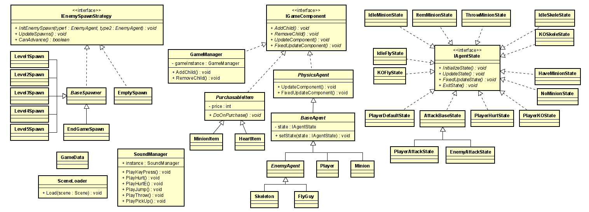

# Tomato Town (Replace with your Team Name and Journal)

# Team Journals
Hardwin Bui: https://github.com/nguyensjsu/fa21-202-tomato-town/blob/main/HardwinProjectJournal.md 
Kenneth Yang: https://github.com/nguyensjsu/fa21-202-tomato-town/blob/main/KennethProjectJournal.md

# Class Diagram

# Game State Diagram

# Asset Credits

Background Art:
https://quintino-pixels.itch.io/wasteland-plataformer-tileset 
Character Art:
https://clembod.itch.io/warrior-free-animation-set 
Minion Art:
https://pixelfrog-assets.itch.io/pixel-adventure-2 
Skeleton Art:
https://jesse-m.itch.io/skeleton-pack 
Fly Guy Art:
https://luizmelo.itch.io/monsters-creatures-fantasy 
UI Art:
https://o-lobster.itch.io/platformmetroidvania-pixel-art-asset-pack 
Music:
https://svl.itch.io/rpg-music-pack-svl
