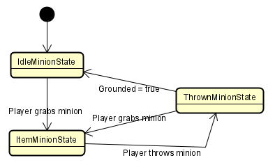

# Tomato Town
The game we created is called Pit Escape. It is an action-packed endless beat-em-up-esque game. One of the main attacks is a single ball that you can throw around. You must pick up the ball to use it again.  

# Video Links
User Story Video: https://www.youtube.com/watch?v=Bqckl0iieC8 
Demo Video: https://www.youtube.com/watch?v=7kxChdzUHMY

# Team Journals
Hardwin Bui: https://github.com/nguyensjsu/fa21-202-tomato-town/blob/main/HardwinProjectJournal.md 
Kenneth Yang: https://github.com/nguyensjsu/fa21-202-tomato-town/blob/main/KennethProjectJournal.md

# Wireframe

# Class Diagram
All classes are dependent on the GameManager class.

# Game State Diagram

# Key Design Features

<h3>Composite Pattern</h3> 
In Unity, it is more efficient if there is one class calling the Update() and FixUpdate() functions. With this in mind, we used the Composite Pattern to setup the architecture in a way so that one main class, the GameManager.cs singleton class, that takes in all classes that share its Composite Pattern. The GameManager class will then call Update and FixUpdate for each of its child classes.
  

<h3>State Pattern</h3> 
The State Pattern was used to organize the behaviors of the main agents of the game; the player, minions, and enemies. This organization allowed for more modularization and made adding additional mechanics cleaner. Below are all the classes that implement the State Pattern:
  

The Player class is slightly different in the other agent classes in that it uses the State Pattern twice. It has a main state that controls the action of the player that doesn't involve the minion. It then also has a substate that determines if the player can grab or throw the minion. This was done since we wanted the minion interaction to be seperate with the rest of the player functionality. 
  

The Minion class state system has only three state; the idle, item, and thrown states. Idle state has the minion stay stationary and avoids interactions with enemies. Item state forces the minion the follow along the player. In the Thrown state, the minion tries to detect hit collision with enemies and attacks them if it does.
  

The Skeleton class state system stays in the idle state until the player moves close enough, which then causes the system to switch into the attack state. The KO state is only entered when the skeleton dies.
  

The FlyGuy class has a very simple state system where it only changes when it dies.
  

<h3>Strategy Pattern</h3> 
The Strategy Pattern is used to decide how enemies should be spawned in each level of the game. This allowed us to set the difficulty of each level. Adding additional levels in future updates would also be easy as we'd just have to make a new class that implements the pattern.
  

# Asset Credits

Background Art:
https://quintino-pixels.itch.io/wasteland-plataformer-tileset 
Character Art:
https://clembod.itch.io/warrior-free-animation-set 
Minion Art:
https://pixelfrog-assets.itch.io/pixel-adventure-2 
Skeleton Art:
https://jesse-m.itch.io/skeleton-pack 
Fly Guy Art:
https://luizmelo.itch.io/monsters-creatures-fantasy 
UI Art:
https://o-lobster.itch.io/platformmetroidvania-pixel-art-asset-pack 
Music:
https://svl.itch.io/rpg-music-pack-svl
